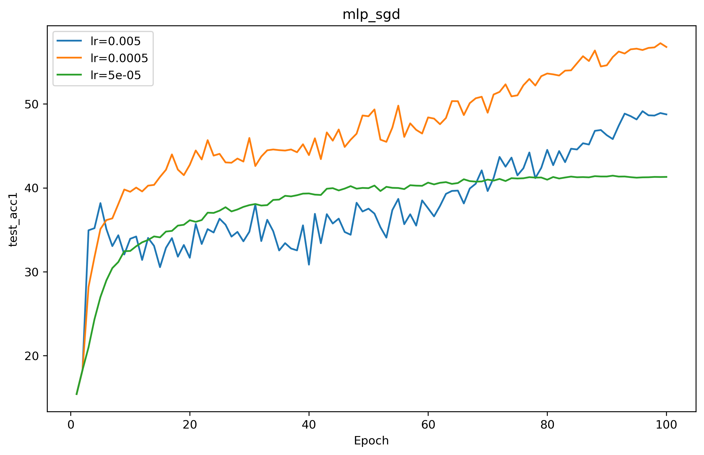
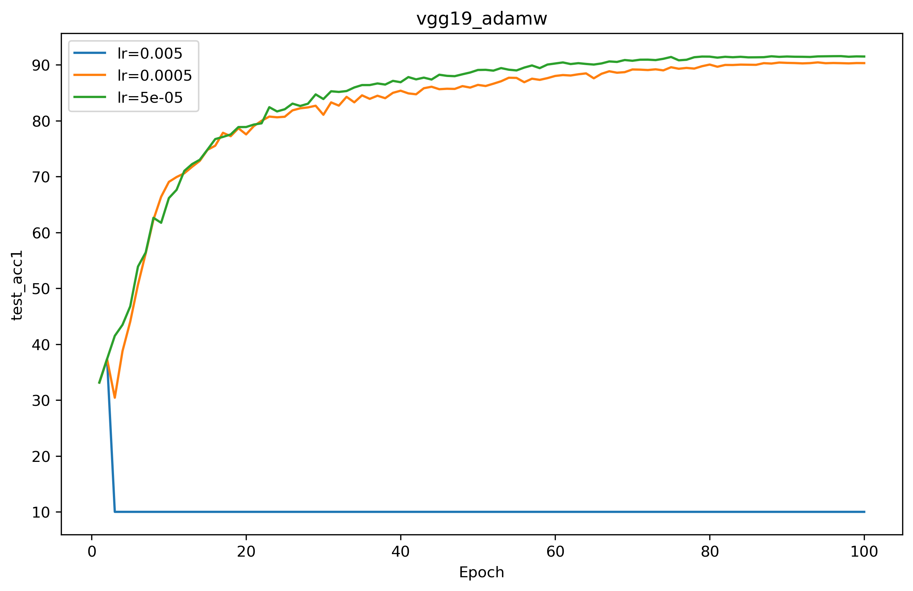
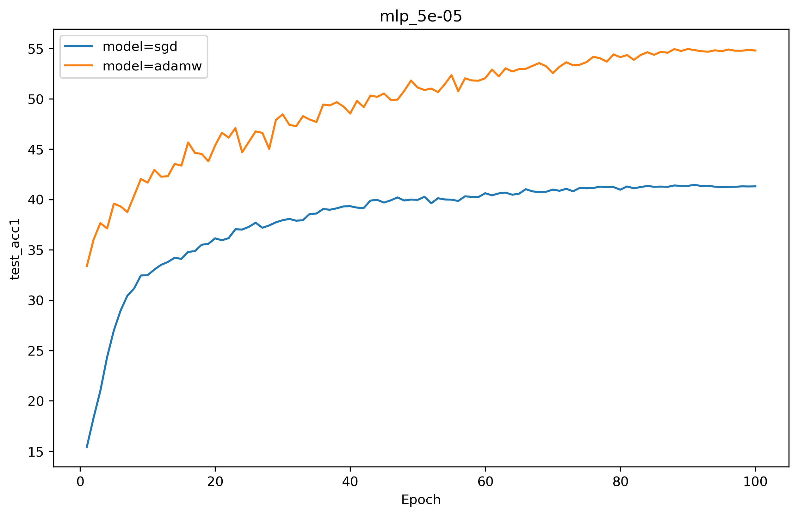
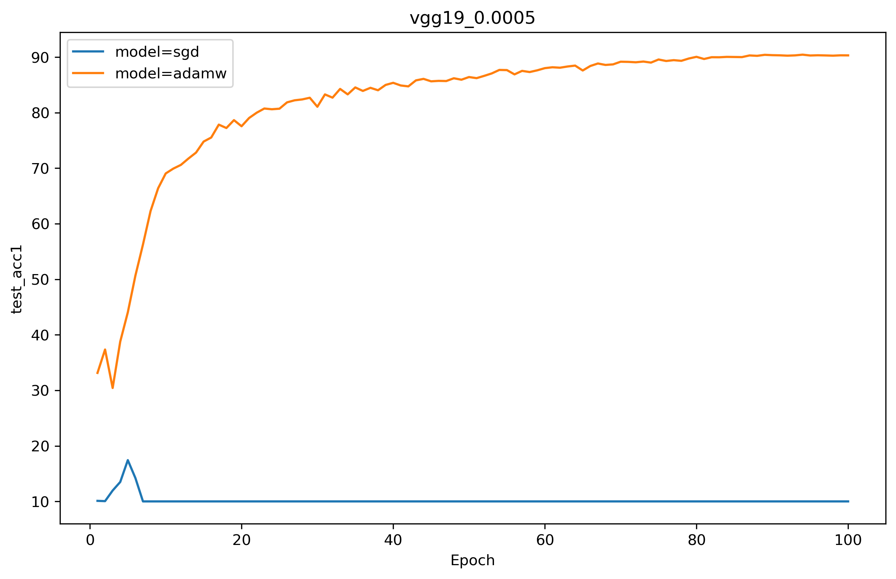
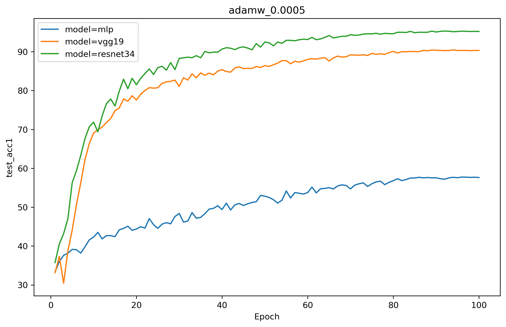
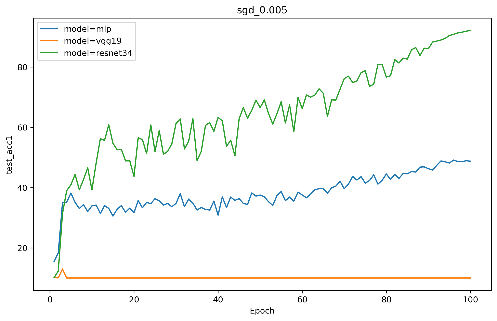
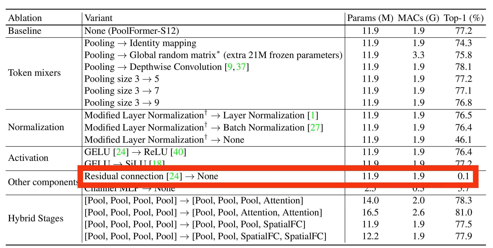

# 实验报告

## 实验介绍
根据实验要求： 
我选择的模型有三个：**mlp**，**vgg19**，**resnet34**。其中mlp是自己实现的，由于resnet原论文中是用resnet34和vgg19做对比，故这里选用vgg19和resnet34，又因为这两个网络过于经典，于是用的torchvision的官方实现，详见[model.py](models.py) 
我选择的优化器有两个：**sgd**和**adamw** 
我选择的优化率有三个：**5e-3**，**5e-4**，**5e-5** 
所以我一共做了 **3 * 2 * 3 = 18** 个实验，详见[mlp](mlp), [vgg19](vgg19), [resnet34](resnet34),这些文件夹里记录了train log，checkpoint由于太大，就没上传了。 
>注： 
> 所有实验均单卡训练 
> 为了方便收敛，lr 策略均采用 cosine 衰减 
> 由于我的 lr 设置的跨度较大，有的训练跑飞了，但这也非常能反映问题，故没有调参使其正常收敛 
> 所有的实验的 batch size 均设置为 128 
> 所有实验的训练 epochs 均设置为 100

## 消融实验
消融实验我分三个部分：
1. **不同学习率（模型，优化器相同）**，所有实验结果图在[diff_lr](plot/diff_lr)目录下，绘图脚本在[diff_lr/plot.py](plot/diff_lr/plot.py)
2. **不同优化器（模型，学习率相同）**，所有实验结果图在[diff_opt](plot/diff_opt)目录下，绘图脚本在[diff_opt/plot.py](plot/diff_opt/plot.py)
3. **不同模型（优化器，学习率相同）**，所有实验结果图在[diff_mdl](plot/diff_mdl)目录下，绘图脚本在[diff_mdl/plot.py](plot/diff_mdl/plot.py)
> 注： 
> 由于实验结果数据太多，下面分析只挑选有代表性的做汇报 
> 完整实验请到对应目录查看 

### 不同学习率（模型，优化器相同）

这个实验是mlp模型选用sgd优化器，对比三个不同的lr下的test_acc1曲线 
可以有以下几点很明显的发现：
1. **初期** 大lr在初期的时候达到了更高的test_acc1，小lr在初期收敛速度最慢
2. **中期** 越大的lr的训练曲线越震荡，越小的lr收敛曲线越平滑
3. **后期** 可以发现中等lr在训练结束达到了最高的test_acc1，说明lr不是越大越好也不是越小越好，是一个需要调节的超参

这个实验是vgg19模型选用adamw优化器，对比三个不同的lr下的test_acc1曲线 
**过大的lr直接让训练跑崩了！**

### 不同优化器（模型，学习率相同）

这个实验是mlp模型选用5e-05的lr，对比两个不同的opt下的test_acc1曲线 
可以有以下几点很明显的发现：
1. adamw由于考虑了动量等因素，可以让模型更快的收敛
2. adamw优化器和sgd优化器相比，在训练结束时达到了更高的test_acc1

**所有实验都反映了以上两点！这里仅贴了一个结果。**

这个实验是vgg19模型选用0.0005的lr，对比两个不同的opt下的test_acc1曲线 
**sgd优化器直接让训练崩溃，然而adamw让网络正常收敛！**

### 不同模型（优化器，学习率相同）

这个实验是adamw优化器选用0.0005的lr，对比三个不同的model下的test_acc1曲线 
可以有以下几点很明显的发现：
1. resnet34就是比vgg19要好，vgg就是比mlp要好，这是符合经验的，也是符合论文中的实验结果的
2. resnet中的skip connection 确实让网络收敛更快，并且达到了更高的 test_acc1

这个实验是sgd优化器选用0.005的lr，对比三个不同的model下的test_acc1曲线 
**这是一个超大的lr，配合一个超烂的opt，结果vgg19崩了，resnet34在skip connection的加持下，虽然剧烈震动，但仍然持续收敛** 
**这恰恰反映了resnet论文的主旨：让网络训练得更深！** 
**这也导致skip connection 成为现在大模型不可或缺的一个重要组件，去掉这小小的一根线，训练直接崩溃，见下图（来自[MetaFormer](https://openaccess.thecvf.com/content/CVPR2022/papers/Yu_MetaFormer_Is_Actually_What_You_Need_for_Vision_CVPR_2022_paper.pdf)中的消融实验）**

# 谢谢老师！